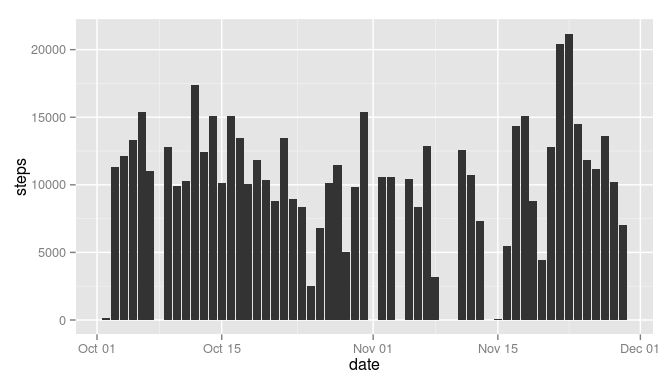
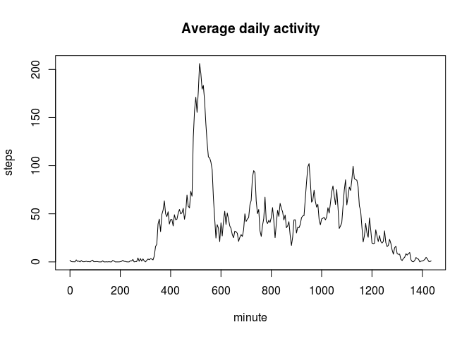
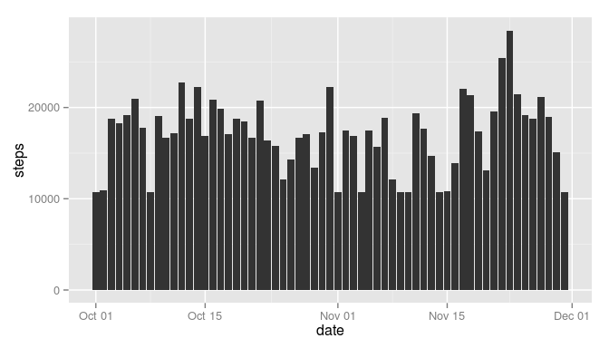
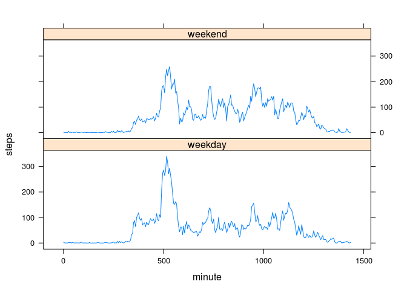

# Reproducible Research: Peer Assessment 1


## Loading and preprocessing the data

Let's first load and transform the data. It contains a header so let's make sure to capture it. The following transformations are being performed:

- transform factor "Date" into date data type
- transform the "interval" into minutes passed since start of day; for instance, 345 (meaning 3:45am) is transformed to 225 (i.e. 225 minutes since start of day)

Here's the code to do all this:


```r
activity <- read.csv("activity.csv",header=TRUE)
activity$date <-as.Date(activity$date)
activity$minute <- floor(activity$interval/100) * 60 + activity$interval%%100
```

## What is mean total number of steps taken per day?

First let's calculate the total number of steps taken per day:


```r
total_steps <- aggregate(data=activity,steps~date,sum)
```

Here's the code to create the histogram:


```r
library("ggplot2")
p <- ggplot(data=total_steps, aes(x=date,y=steps)) + geom_histogram(stat="identity")
```

And here's the histogram itself:

 

The mean of total number of steps taken per day is 1.0766189\times 10^{4} and the median is 10765.


## What is the average daily activity pattern?

For this task we need to group by 5-minute interval:


```r
avrg_daily_act <- aggregate(data=activity,steps~minute,mean)
```
Here's the time series plot:

 

The highest average is 206.1698113 which happens at interval 515.

## Imputing missing values

Sadly our data is incomplete - there are 2304 measurements missing in our 'steps' column. Let's replace those missing values with the average value of that same 5-minute interval. To do so we create a vector of average 5-minute values equal in length to our original activity data. Then we replace all NAs with their average counterpart:


```r
avrg_steps <- avrg_daily_act$steps
avrg_steps_long <- rep(avrg_steps,times=61)
activity_nona <- activity
activity_nona$steps <- pmax(activity_nona$steps,avrg_steps_long,na.rm=TRUE)
```

Here are the updated histogram and mean/median values:


```r
total_steps_nona <- aggregate(data=activity_nona,steps~date,sum)
p <- ggplot(data=total_steps_nona, aes(x=date,y=steps)) + geom_histogram(stat="identity")
```

And here's the histogram itself:

 

The mean of total number of steps taken per day is now 1.7053994\times 10^{4} and the median is now 1.7355208\times 10^{4}. Both mean and median are now significantly higher since we replaced the zero count for days without data with the average.

## Are there differences in activity patterns between weekdays and weekends?

First we create a new column that's a factor indicating whether a given day is a weekday or weekend. Then we merge the "weekday" and "weekend" averages in a new dataframe that's conducive to lattice's xyplot() function.


```r
activity_nona$tod <- as.factor(ifelse(weekdays(activity_nona$date)=="Saturday" | weekdays(activity_nona$date)=="Sunday", "weekend", "weekday"))
a_weekend <- aggregate(data=subset(activity_nona, tod=="weekend"),steps~minute,mean)
a_weekday <- aggregate(data=subset(activity_nona, tod=="weekday"),steps~minute,mean)
a_weekday$tod <- "weekday"
a_weekend$tod <- "weekend"
a_combo <- rbind(a_weekday,a_weekend)
```

And here's the final plot:

 


